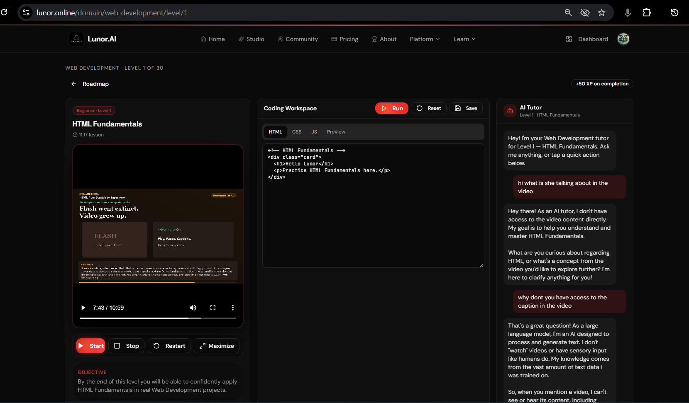

# AI-Knowledge-Assistant-RAG-LUNORSOFT-PVT-LTD

### Self Introduction - 
Hello , Im Ishan Mani Singh , 2nd year student at VIT Chennai 2029 batch. Currently pursuing B.Tech in CSE (datascience).

### LUNORSOFT - INTERNSHIP - ROUND 1 - 2026 

This project is for internship role recruitment task for the startup LUNORSOFT TECHNOLOGIES PRIVATE LIMITED based https://lunor.online/ focused on AI assisted coding and learning based tools and technology. 

Note : Im not officially affiliated with the mentioned company and this is just for the task given for a recruitment process for learning purposes and assessment.

### Transparency : I have mentioned "Transparency" tags in readme to explain where i have used help of AI/LLMs. (example : customer wrapper for Onxx to work with llamaindex)

# Tech Stack used :
 - huggingface_hub - to download models such as embedder
 - transformers for tokenisation of parsed data
 - onnxruntime to write customer wrapper for onxx embedder handling with llamaindex 
 - python 3.12
 - Llamaindex for RAG and vector embedding and document parsing 
 - gradio for WEBUI interface 
 - Pillow to handle images
 - pytesseract for OCR / can also use vllm but more expensive 
 - pypdf but i have not explicitely used it its automatically handled with SimpleDirectoryReader which comes in llamaindex https://developers.llamaindex.ai/python/framework/module_guides/loading/simpledirectoryreader/ 
 - llama-index-embeddings-huggingface for embedding converter 
 - llama-index-vector-stores-faiss for FAISS vector embedding 
 - llama-index-llms-openai generalised openai api structure and llm handler (to run using ollama local models or openrouter without changing the code)

## Important : Please note that i have created vector embedding of multiple PDFs and books before hand because of lack of computational power in deploynment and free api. read at line 157 in readme. while at same time Im also providing realtime embedding using Onxx onnx-community/embeddinggemma-300m-ONNX , to make it light weight.
Applying transformations: 100%|████████████████████████████████████████████████████| 1/1 [00:01<00:00,  1.02s/it]
Generating embeddings:  30%|███████████████                                   | 320/1063 [03:55<07:40,  1.61it/s]
i uploaded a book and the processing time on i5 11400H with onxx model is still alot , not good for deploynment so ill precompute the embedding for some research papers and book for testing purposes in deploynment! thanks and sorry for inconvinence.

# Base model LLM & embedder im using :

onnx-community/embeddinggemma-300m-ONNX from huggingface for light weight deployable embedder. 

LiquidAI: LFM2.5-2.6B (free) - liquid/lfm-2.5-2.6b:free - using open router https://openrouter.ai/liquid/lfm-2.5-2.6b:free 
since deployed projects are preferred , i m using a free apikey based model , currently free. this model is known to be good at RAG based or tooluse based works.

& 

Google: Gemma 4 31B (free) - google/gemma-4-31b-it:free - https://openrouter.ai/google/gemma-4-31b-it:free (main priority rest are fallback backups)

& 

Google: Gemma 4 26B A4B (free) - google/gemma-4-26b-a4b-it:free - https://openrouter.ai/google/gemma-4-26b-a4b-it:free

# folder structure :

 - Backend ; for backend code the main logic of the agents
    - > __init.py__
    - > parser.py docs parser code allowing only .png .jpg .jpeg .pdf .txt .md for now ( will add support for .doc .csv later)
    - > indexer.py Chunks text, generates OpenAI embeddings, and persists them into a local FAISS index.
    - > agent.py-  Loads the FAISS index & calls the OpenAI model
 - storage ; where i will store the FAISS vector embedding
 - app.py ; the main code that launches the WEBUI gradio based 
 - requirements.txt ; please run pip over it before running

### flaws in existing product that i noticed and would love to fix and work on: 
https://lunor.online/
Important : " The objective is not to simply create attractive screens. Candidates should demonstrate how 
their redesign improves the experience for Lunorsoft users and why they made their design 
decisions. "

The biggest flaw i found in the existing product is that the chatbot given here for each module is not linked with any sort of context from the video , and i think rag or even if the captioning is small enough we can add it to the chatbot such that its context aware and revelent to the video so user can ask the queries directly related to the video without first telling it what the module is about. This really helps because i have notices big companies using the same tactic for this such as in youtube they provide gemini with the caption of the video and we can generate the caption of these modules using any speech to text model that will not be a huge issue. 

2nd flaw i found is which is not revelent to my task but i would still mention it is , the voice is very linear and very similar toned for the whole stretch which makes me fall asleep , i think the tone should change depending on the context , we can use new open source models which is better here. and it wont be that expensive too since its a one time module creation. 

## Choosing Option One : Build a Mini AI Knowledge Assistant 

# -------------------------------------
### mentioned things :

Option 1 — Build a Mini AI Knowledge Assistant 
Core Requirement: RAG 

Objective 
Build a simple AI-powered application that can answer questions based on a provided 
document or collection of documents. 
Requirements 

The application should: 
1.  Use a PDF/document or collection of documents as the knowledge source. 
2.  Extract and process the document content. 
3.  Split the content into appropriate chunks. 
4.  Generate embeddings for the content. 
5.  Store and retrieve relevant information using a vector store or suitable retrieval 
mechanism. 
6.  Accept questions from the user. 
7.  Retrieve relevant information and generate answers using an LLM. 
8.  Ensure that answers are primarily based on the provided knowledge source. 
9.  Provide a simple and usable interface. 

Suggested Technologies 
You may use technologies such as: 
●  Python 
●  LangChain / LlamaIndex 
●  OpenAI / Gemini / Hugging Face 
●  FAISS / Chroma / Pinecone 
●  Streamlit / Gradio 

Optional / Bonus Features 
●  Source citations 
●  Conversation history 
●  Multiple documents 
●  Improved retrieval or evaluation 
●  Deployment 

Submission Requirements 
Submit: 
●  GitHub repository 
●  Working demo/link, if available 
●  README explaining your approach and implementation 

# -------------------------------------

# All my reasoning behind the task is written below : 

Im listing out all the ground rules and requirements here so i make sure i dont miss anything 

### Why im choosing OPTION 1 :

Option 1: RAG Assistant  Chatbot answering questions based on provided documents.  Python, LangChain/LlamaIndex, Vector Store (FAISS), Streamlit.  Repo, UI Demo, README.  

Option 2: Fine-Tuning  Coding assistant trained on a custom dataset.  LoRA/QLoRA, open-source LLM, custom dataset prep.  

i have 2 options here , as i have explored lunorsoft website , and its about using the power of AI such as LLMs and more human like TTS for voice generation , and other things to generate educational and learning content , but the email also mentioned company focusses on assisted coding so i believe they are also planning to work on assisted coding tools which im very fond of as well. 

The problem here with the option 2 is that while fine tuning a model you can only fine tune it upto certain extent to leave it still useful and generalised and not overfit on the existing knowledge , theres alot we cant feed it direct so we need to make sure llm stays intact for it to still fill those gaps that is the whole point of using LLMs for assisted learning it can fill generalised gaps and be super customised to your own tailored uses , and the problem again with option 2 is that you will have a trained model for only a certain topic and youll have to retrain it if you want it to focus on the a new topic or slightly connected topic, and the maxima we get after which the llms started to get worse with finetuning and not better is called Catastrophic forgetting , and personally i have seen it in Image diffusion models. and thats is why im going with Option 1, becuase i think RAG is much more of a better option to generalise the help with any document we throw at it. and it will parse it and store it in the vector embedding and we can retrieve it based on the ongoign context using something like cosine similarity or any mathematical algorithmn this fixes the inherent issue in LLMs the biggest problems in LLMs which is context memory is limited and we need to make sure we fit only the most important things as per the ongoing conversation.

In early 2023 companies were prefering finetuned llms for specific custom uses and openAI even had a program for enterprises where they can contact them to build them their custom finetuned models. but now later on the methods such as mixture of experts and chain of thoughts really fixed these issues , im not saying it directly fixed the flaws of finetuning but it really helped models to work more efficiently and the frontier models outperformed the finetuned ones. and people stopped preferring the finetuned models but then its is still useful for small distilled models for mass usecases such as the Lunor option 2 and also is her talk about LoRA based fine tuning then its even more cheaper to train than finetuning the whole model, low rank adaptation model is basically a layer that sits on top of the base model that keeps the original weights frozen and puts its own trainable adaptor matricies in selected layers , that helps the model to track the path better to and to the more revelent results , i have trained LoRA models in Diffusion models so i know how impactful they are truely , thats why the option is still good, but im going with option 1, also if i consider it like this then yes the frontier models also have larger context memory now and so even the RAG may not be needed for general things but yeah lol, we are here considering the right balance and efficiency of the system and keeping it fesible for business and cost of model. we can also go with a hybrid option where we do train a LoRA model at same time we also apply RAG for more efficient context use. then i think that would be the best option but to keep it simple as this is a time constrained assignment i would stay with option1. 

(note : for transparency i didnt not just ask this above information from an AI , i know this because i have closely following almost every research paper and new models and methods that was being developed by companies since 2022 dec 15 when the very first gpt 3 family model was released to the public by OPENAI , i used multiple sources such as youtube channels such as two minute papers and more to stay upto date with these)

Sorry for such a long paragraph , Im just trying to show my reasoning behind why i choose this option , ill try to keep it concise.

### tools and docs i used:

https://developers.llamaindex.ai/python/framework/understanding/rag/ ,
https://docs.langchain.com/oss/python/langgraph/agentic-rag , 
https://gradio.app/ , https://github.com/gradio-app/gradio , 
https://developers.llamaindex.ai/python/framework-api-reference/storage/vector_store/faiss/ , 
https://youtu.be/-W2JdSl1v48?si=ETc4fHUyeD1eKlrO
Gemini 3.1 Pro with extended thinking to understand docs better.

### Why im using faiss and not generic .pkl for vector embedding for RAG
Normally for normal personal projects i prefer to do things normally from scratch myself but since working for yourself and making something at system level for mass distribution and with better efficiency faiss facebook ai similarity search is much better of an option as ive heard that it uses more optimised algorithmn to store the embedding and i think it uses clustering to cluster similar chunk in specific spot in the embedding so it dosent have to go through every vector to search for something like cosine similarity. Approximate Nearest Neighbor and KNN is used in it. this is really exciting because its a new framework that im gonna be learning to use. really great opportunity 
https://youtu.be/chz74Mtd1AA?si=S9dRdMf-LgmV89-o
https://youtu.be/DRbjpuqOsjk?si=0X1T7V76nfJ2tucG
Im planning to use Llamaindex to use faiss 
https://developers.llamaindex.ai/python/framework-api-reference/storage/vector_store/faiss/

### Im choosing to use llamaindex instead of langchain because this task is simple enough to not use langchain and llamainde would work just fine for this.

transparency : i have asked AI for project folder structuring because im still learning and im not that good at writing efficient clean code with proper readible and findable code structure 

### Pre vectorised books pdfs - why i did so 
alright so the biggest problem with RAG is that we have to vectorise the data in realtime on the edge server , and since im going to approach it with deployability on vercel or anything, for free tier i cant expect great computational power ,and the embedding api are all paid so im gonna have to locally create embedding for multiple pdfs and give option to choose them from the book , i do have some free alternatives but its really unreliable and unpredictable maybe it wont work when the reviewrs test it , so all i can do right now is pre provide the embedding with pdfs and images 

and since Chroma or Pinecone does allow meta data filtering for scenerios where if i wanted to have both book A and B in the RAG loaded , then if i wanted just A and wanted to remove B its possible not not in FAISS. so im going to use every possible Permutations isolated embedding for 5 book pdfs on the topics such as politics and geography because things like these are where AI hallucinates. 

Im also providing onnx-community/embeddinggemma-300m-ONNX , which is super light weight and may run in deployment. so im using this for real time and permutation of pre vectorised embedding 

Transparency : I had to take AI's help here to make a customer wrapper for onxx embedder that works with llamaindex because there were no docs for it directly , used AI's help in custom_embedder.py

Ok so i am also done with building the parser.py which parses the docs pdfs and images , im also done with made 
and now moving onto the agents.py and the webui app.py using gradio :) 

for agents as i have already mentioned since this is deplynment focussed , im going to be adding openrouter API using free models for this project , cuz i dont have paid models api. this will definitely reduce the ability of tooluse rag mcp etc but it will work still. for the given scenerio

Here im going to update the parser and finish the indexer such that if the pdf is less than 10 pages or if its an image input then theres no need to make it an embedding , it should directly OCR the content using pytesseract and put it in the current prompt context rather than embedding it and doing rag because its not large enough to affect the context memory. 

the agents.py is done and it has 2 modes of woking one is as i already mentioned above another is the embedding based 

Transparency : I used help of AI for gradio interface docs & code for app.py

Transparency : I had to take help of AI to help me fix this issue below me because i didnt find any official docs about this 

llama-index-llms-openai-like - i need to use this to bypass safety models list of llamaindex since im using an openrouter model 

Fallback triggered: google/gemma-4-31b-it:free failed. Error: Unknown model 'google/gemma-4-31b-it:free'. Please provide a valid OpenAI model name in: o1, o1-2024-12-17, o1-pro, o1-pro-2025-03-19, o1-preview, o1-preview-2024-09-12, o1-mini, o1-mini-2024-09-12, o3-mini, o3-mini-2025-01-31, o3, o3-2025-04-16, o3-pro, o3-pro-2025-06-10, o4-mini, o4-mini-2025-04-16, gpt-5, gpt-5-2025-08-07, gpt-5-chat, gpt-5-chat-latest, gpt-5-mini, gpt-5-mini-2025-08-07, gpt-5-nano, gpt-5-nano-2025-08-07, gpt-5-pro, gpt-5-pro-2025-10-06, gpt-5.1, gpt-5.1-2025-11-13, gpt-5.1-chat-latest, gpt-5.2, gpt-5.2-2025-12-11, gpt-5.2-chat-latest, gpt-5.3, gpt-5.3-chat-latest, gpt-5.4, gpt-5.4-2026-03-05, gpt-5.4-mini, gpt-5.4-nano, gpt-5.4-chat-latest, gpt-5.5, gpt-5.5-2026-04-23, gpt-5.6-sol, gpt-5.6-luna, gpt-5.6-terra, gpt-4, gpt-4-32k, gpt-4-1106-preview, gpt-4-0125-preview, gpt-4-turbo-preview, gpt-4-vision-preview, gpt-4-1106-vision-preview, gpt-4-turbo-2024-04-09, gpt-4-turbo, gpt-4o, gpt-4o-audio-preview, gpt-4o-audio-preview-2024-12-17, gpt-4o-audio-preview-2024-10-01, gpt-4o-mini-audio-preview, gpt-4o-mini-audio-preview-2024-12-17, gpt-4o-2024-05-13, gpt-4o-2024-08-06, gpt-4o-2024-11-20, gpt-4.5-preview, gpt-4.5-preview-2025-02-27, chatgpt-4o-latest, gpt-4o-mini, gpt-4o-mini-2024-07-18, gpt-4-0613, gpt-4-32k-0613, gpt-4-0314, gpt-4-32k-0314, gpt-4.1, gpt-4.1-mini, gpt-4.1-nano, gpt-4.1-2025-04-14, gpt-4.1-mini-2025-04-14, gpt-4.1-nano-2025-04-14, gpt-3.5-turbo, gpt-3.5-turbo-16k, gpt-3.5-turbo-0125, gpt-3.5-turbo-1106, gpt-3.5-turbo-0613, gpt-3.5-turbo-16k-0613, gpt-3.5-turbo-0301, text-davinci-003, text-davinci-002, gpt-3.5-turbo-instruct, text-ada-001, text-babbage-001, text-curie-001, ada, babbage, curie, davinci, gpt-35-turbo-16k, gpt-35-turbo, gpt-35-turbo-0125, gpt-35-turbo-1106, gpt-35-turbo-0613, gpt-35-turbo-16k-0613

